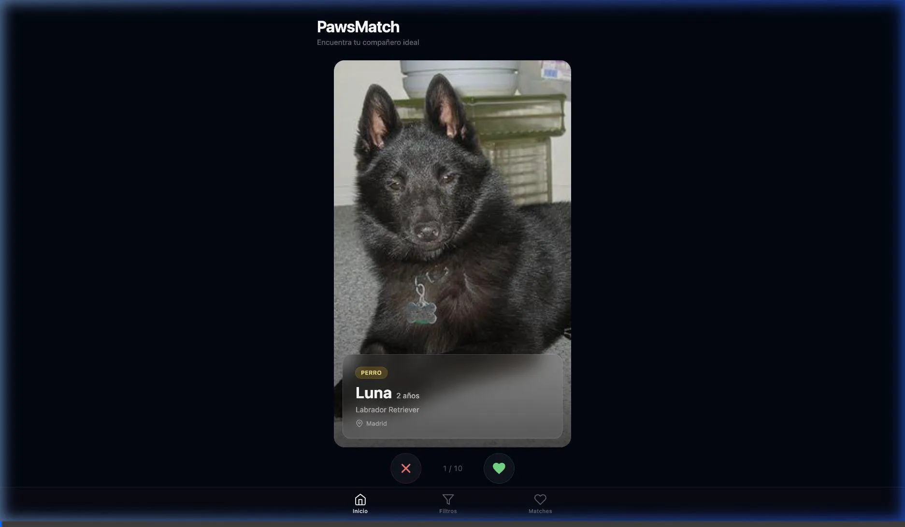
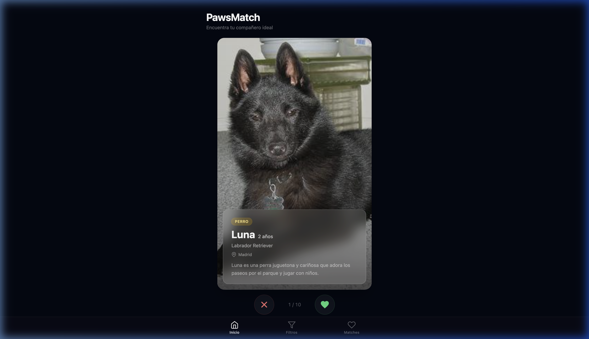
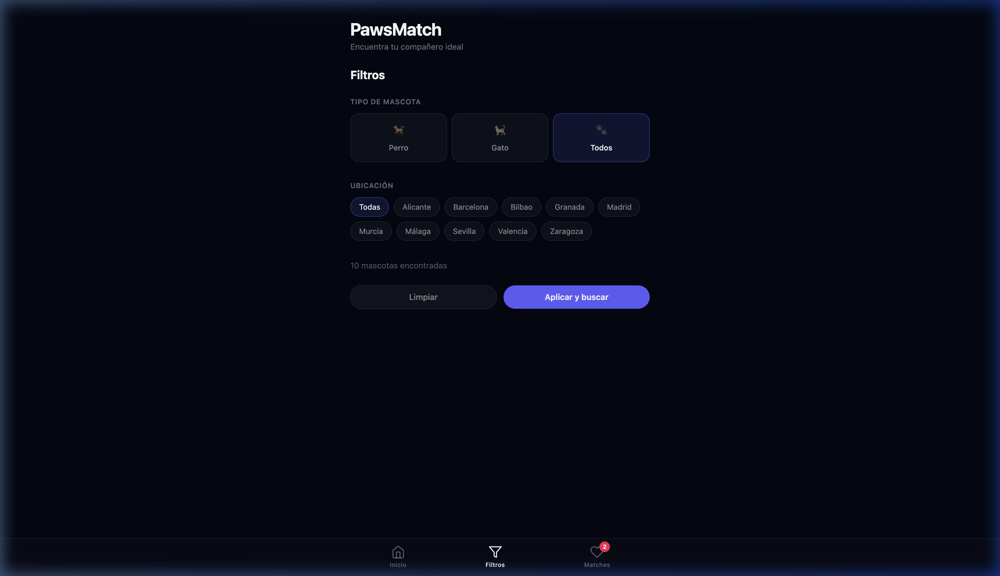
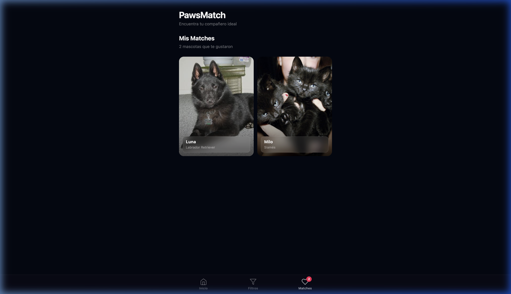
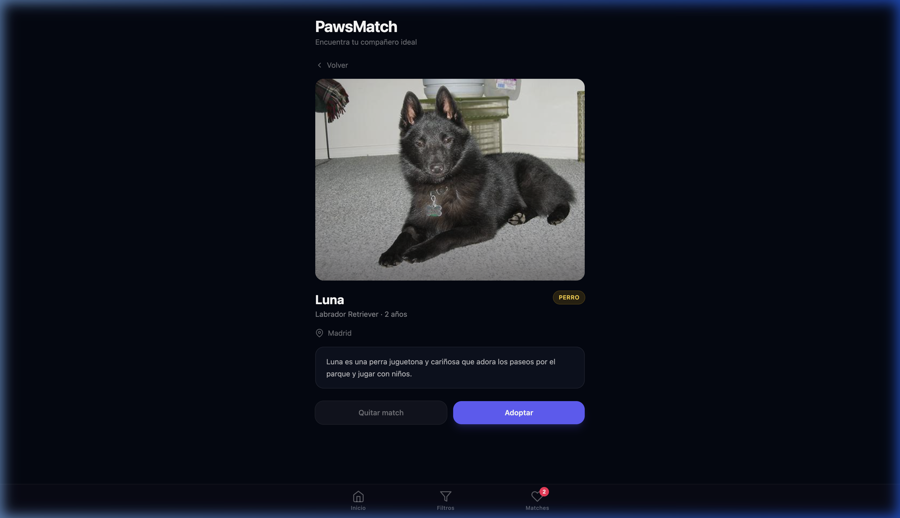
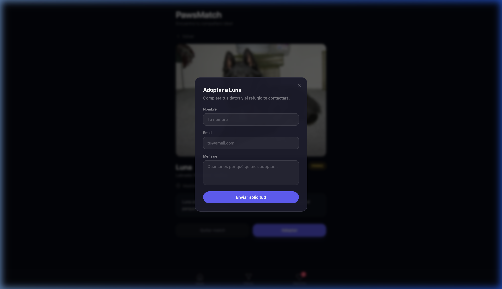

# PawsMatch

PawsMatch es una aplicación web de adopción y matching de mascotas con interfaz tipo Tinder. Explora perros y gatos disponibles para adopción haciendo swipe, guarda tus favoritos y simula el proceso de adopción.

## Stack Tecnológico

| Tecnología | Versión | Propósito |
|---|---|---|
| **Vue 3** | 3.5+ | Framework UI con Composition API y `<script setup>` |
| **Vite** | 8+ | Build tool y dev server con HMR |
| **Pinia** | 3+ | State management reactivo para Vue |
| **Tailwind CSS** | 4+ | Utilidades CSS con plugin Vite nativo (sin PostCSS) |
| **Vue Router** | 4+ | Navegación SPA con lazy-loading de vistas |

## Características

- **Swipe cards** — Touch events (mobile) + mouse drag (desktop) con animación de rotación y salida
- **Pre-fetch buffer** — Carga las próximas 3 imágenes en background para transiciones instantáneas
- **Diseño glassmorphism** — `backdrop-filter: blur()` con bordes sutiles en cards, navbar, modal y filtros
- **APIs reales** — Dog CEO API para fotos de perros, TheCatAPI para fotos de gatos
- **Filtros** — Por tipo de mascota (perro/gato) y por ubicación
- **Matches** — Grid de mascotas guardadas con vista de detalle
- **Flujo de adopción** — Modal simulado de contacto con el refugio
- **Mobile-first** — Diseño responsivo, navegación inferior fija

## Estructura del Proyecto

```
src/
  components/
    AdoptModal.vue       — Modal glassmorphism de contacto para adopción
    NavBar.vue           — Barra de navegación inferior con glassmorphism
    PetCard.vue          — Card de mascota con foto fullbleed y overlay glass
    SwipeContainer.vue   — Motor de swipe (touch + mouse) con animaciones
  views/
    HomeView.vue         — Vista principal con swipe y botones like/pass
    FiltrosView.vue      — Filtros por tipo y ubicación
    MatchesView.vue      — Grid de mascotas likeadas
    PetDetailView.vue    — Detalle de mascota con botón de adoptar
  stores/
    pets.js              — Store Pinia: mascotas, filtros, matches, pre-fetch
  services/
    petService.js        — Fetch a Dog CEO API y TheCatAPI, cache e image preload
  router/
    index.js             — Rutas: /, /filtros, /matches, /matches/:id
  data/
    pets.json            — 10 mascotas de ejemplo (5 perros, 5 gatos)
  style.css              — Import de Tailwind CSS v4
  main.js                — Entry point: Vue + Pinia + Router
```

## Requisitos Previos

- Node.js >= 20
- npm >= 10

## Instalación

```bash
git clone <repo-url>
cd PawsMatch
npm install
```

## Desarrollo

```bash
npm run dev
```

Abre http://localhost:5173 en tu navegador.

## Build para Producción

```bash
npm run build
npm run preview
```

## App Showcase

> **Nota:** las imágenes de mascotas se cargan dinámicamente desde APIs externas, por lo que varían en cada sesión.

### Video Demo

<p align="center">
  
</p>

### Pantallas principales

#### Home — Swipe de mascotas

<p align="center">
  
</p>

Card de mascota con foto fullbleed, overlay glassmorphism con nombre/raza/edad/ubicación, stamps "LIKE"/"PASS" durante el swipe, y botones X y corazón.

---

#### Filtros

<p align="center">
  
</p>

Selector de tipo de mascota (perro/gato/todos) con cards emoji, pills de ubicación dinámicas y contador de resultados.

---

#### Mis Matches

<p align="center">
  
</p>

Grid de 2 columnas con cards glassmorphism de las mascotas que te gustaron.

---

#### Detalle de mascota

<p align="center">
  
</p>

Foto ampliada, información completa (raza, edad, ubicación, descripción) y botones "Quitar match" y "Adoptar".

---

#### Modal de Adopción

<p align="center">
  
</p>

Formulario glassmorphism con campos de nombre, email y mensaje para contactar al refugio.

---

### Flujo de usuario

1. La app carga y muestra la primera mascota con foto real desde la API
2. El usuario hace swipe derecho (o toca el corazón) para dar like, izquierdo (o X) para pasar
3. Las siguientes 3 imágenes se pre-cargan en background para transiciones sin loading
4. Desde "Mis Matches" se puede ver el detalle de cada mascota guardada
5. El botón "Adoptar" abre un formulario simulado de contacto con el refugio
